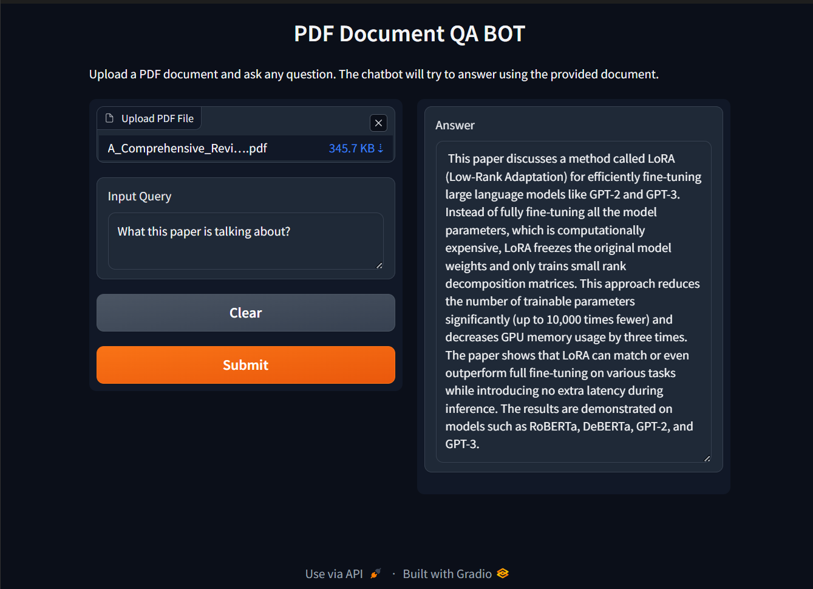

# QA Bot for PDF summarizing using RAG+Langchain with Gradio UI
This repository contains a NLP project focused on an AI agent for summarizing input pdfs. 
The project leverages the LangChain, RAG, Gradio frameworks to create the bot. 

## Technologies
The project utilizes the "mistralai/mistral-medium-2505" model for summarizing.
You can access it directly by using below code:
```
model_id = 'mistralai/mistral-medium-2505'
```

The project also utilizes Gradio for user-friendly interface for chatting with the language model.

## Project Overview
The core of the project is to bulid a PDF summarizing Bot as per instructions from a course under "Generative AI Engineering with LLMs specialization".
The python file is included in this repository provides a detailed walkthrough of the model implementation.

## Procedure to create the model
### Data Processing
Get the pdf as input, use dataloaders to load as Document type, use text splitters to convert them into chunks, store them along with their embeddings in Chroma DB, finally utilize them using RAG.

## Results
Below we have shown the final Interface:
### 📈 Gradio Interface


### 📈 Gradio Interface 2


## Note: 
The project_id and url are to be created by own and added to the code for seamless working of the code.
